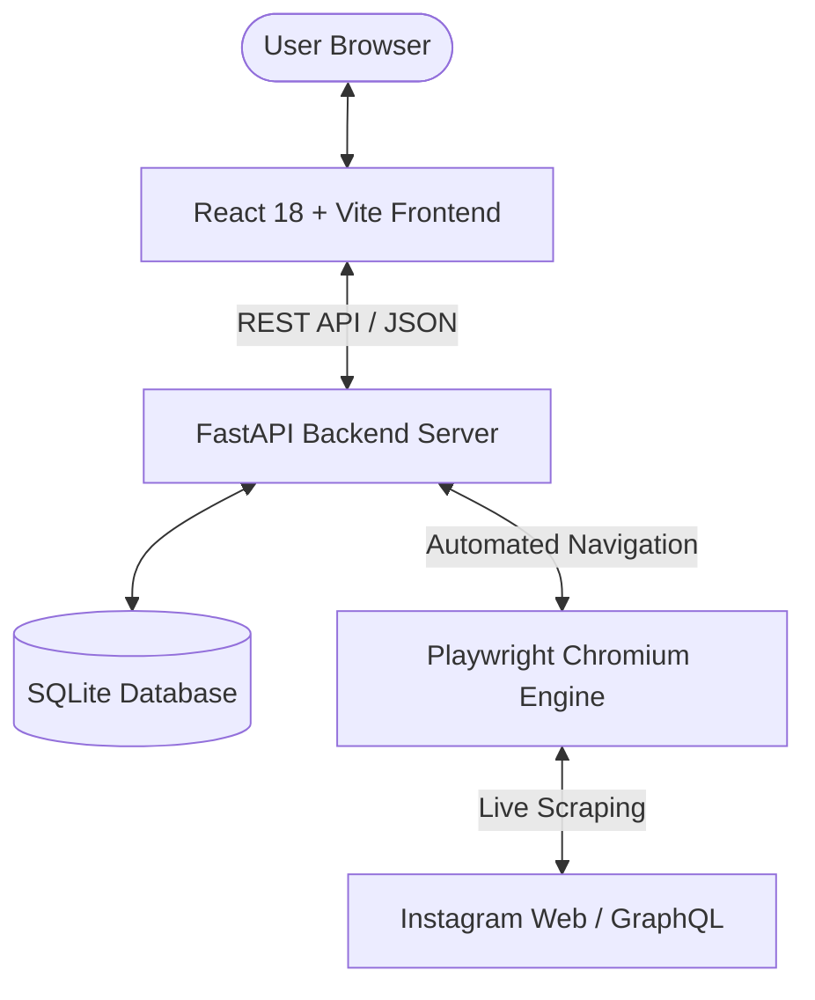

<div align="center">

# 📸 Instagram Scraper & Real-Time Keyword Filter Engine

<p align="center">
  <b>A modern, high-performance web scraping and keyword analytics suite for Instagram posts, hashtags, and profiles.</b>
</p>

[](https://fastapi.tiangolo.com/)
[](https://react.dev/)
[](https://vitejs.dev/)
[](https://playwright.dev/)
[](https://www.python.org/)
[](LICENSE)

<br />


</div>

---

## 📖 Overview

**Instagram Scraper & Keyword Filter Engine** is a full-stack SaaS solution designed to automate Instagram content extraction and perform real-time caption analytics. Powered by **Playwright Chromium**, the engine navigates Instagram's web architecture to pull live posts, actual author `@usernames`, profile pictures (PP), captions, and engagement metrics—all presented in an **Emerald SaaS Glassmorphism Dashboard**.

---

## ✨ Key Features

| Feature | Description |
| :--- | :--- |
| 🤖 **Automated Live Scraping** | Extract posts from `@username` profiles, `#hashtags`, or specific post URLs via headless Playwright Chromium. |
| 👤 **Real Author & Profile Picture Extraction** | Automatically parses GraphQL payloads to extract the actual owner handle (`@username`) and Profile Picture (PP). |
| ❤️ **Exact Engagement Metrics** | Captures exact Likes and Comments metrics directly from Instagram metadata. |
| 🔍 **Substring & Numeric Search Engine** | Search and highlight text substrings (e.g., `"ra"` matches `"ramadhan"`) and numbers (e.g., `"2026"`) across `OR`, `AND`, `EXACT`, and `REGEX` modes. |
| 📊 **Analytics Sorting** | Instantly sort extracted feed items by **Newest**, **Most Likes**, or **Most Comments**. |
| ⚡ **Live Execution Pipeline Stepper** | Visual deployment-style progress pipeline (🟡 Yellow = Running, 🟢 Green = Completed, 🔴 Red = Error). |
| 🚀 **Deep Infinite Scroll (Unlimited Mode)** | Scroll deep into Instagram search grids (`max_posts = 0`) to fetch hundreds of posts. |
| 📋 **1-Click Copy Caption** | Copy post captions instantly with responsive toast notifications. |
| 📥 **Data Export** | Export filtered post datasets in 1-click as **CSV** or **JSON**. |

---

## 🏛️ System Architecture



---

## 🛠️ Tech Stack

- **Frontend**: React 18, Vite, Lucide-React, Modern CSS Glassmorphism Design Tokens.
- **Backend**: Python 3.10+, FastAPI, Playwright (Chromium), SQLite3, Pydantic, Uvicorn.
- **Deployment**: Docker, Vercel (Frontend), Render / Koyeb (Backend Web Service).

---

## 🚀 Quick Start (Local Setup)

### Prerequisites
- Python 3.10 or higher
- Node.js 18 or higher
- Git

### 1. Clone Repository
```bash
git clone https://github.com/elowgelo/Instagram-Scrapper.git
cd Instagram-Scrapper
```

### 2. Backend Setup
```bash
cd backend

# Create virtual environment (optional)
python -m venv venv
source venv/bin/activate  # On Windows: venv\Scripts\activate

# Install requirements
pip install -r requirements.txt

# Install Playwright Chromium binaries
playwright install chromium

# Run FastAPI Server
python -m uvicorn main:app --host 127.0.0.1 --port 8000 --reload
```
> The API server will be available at `http://127.0.0.1:8000`. Swagger API docs at `http://127.0.0.1:8000/docs`.

### 3. Frontend Setup
```bash
cd ../frontend

# Install dependencies
npm install

# Run Vite Dev Server
npm run dev
```
> The web application will be available at `http://localhost:5173`.

---

## 📡 REST API Reference

| Endpoint | Method | Description |
| :--- | :--- | :--- |
| `/api/scrape` | `POST` | Trigger Playwright scraper for `@user`, `#tag`, or post URL |
| `/api/filter` | `POST` | Execute substring & numeric keyword search on stored posts |
| `/api/posts` | `GET` | Fetch all scraped posts from SQLite database |
| `/api/posts` | `DELETE` | Clear all scraped posts from database |
| `/api/export` | `POST` | Export filtered dataset as CSV or JSON file |

---

## 🌐 100% Free Deployment Guide

### 1. Deploy Backend (Render.com / Docker)
1. Login to **[Render.com](https://render.com/)**.
2. Click **New +** &rarr; **Web Service** &rarr; Connect `elowgelo/Instagram-Scrapper`.
3. Set **Language**: `Docker` *(Render reads `backend/Dockerfile` automatically)*.
4. Set **Root Directory**: `backend`.
5. Select **Free Plan** and Deploy.
6. Copy your Render service URL (e.g., `https://ig-scraper-api.onrender.com`).

### 2. Deploy Frontend (Vercel)
1. Login to **[Vercel.com](https://vercel.com/)**.
2. Click **Add New...** &rarr; **Project** &rarr; Import `elowgelo/Instagram-Scrapper`.
3. Set **Framework Preset**: `Vite`.
4. Set **Root Directory**: `frontend`.
5. Add Environment Variable:
   - `VITE_API_BASE_URL` = `https://ig-scraper-api.onrender.com`
6. Click **Deploy**.

---

## 📄 License

Distributed under the **MIT License**. See `LICENSE` for more information.

---

<p align="center">
  Crafted with ❤️ by <a href="https://github.com/elowgelo">@elowgelo</a>
</p>
