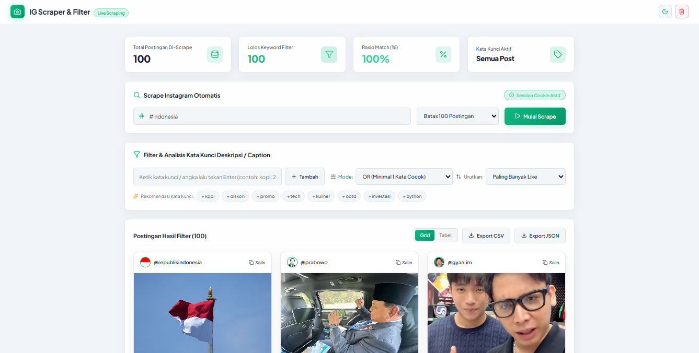
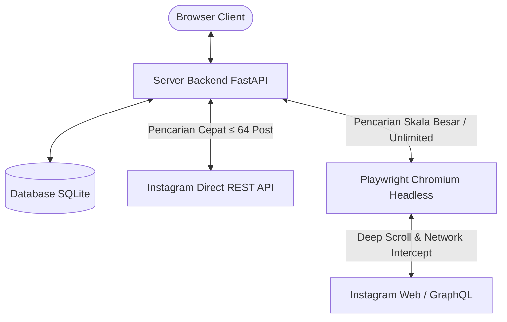

# 📸 Instagram Scraper & Real-Time Keyword Filter

Aplikasi otomatisasi ekstraksi dan pemfilteran kata kunci postingan Instagram berbasis Web dan Desktop.

---

## 📖 Deskripsi Proyek

**Instagram Scraper & Keyword Filter Engine** adalah aplikasi analisis data untuk mengekstrak postingan dari hashtag, profil pengguna, maupun URL postingan Instagram. Sistem mengambil metadata postingan secara otomatis (termasuk caption, media, jumlah like, dan komentar), memfilter kata kunci secara real-time, serta menyediakan opsi ekspor data ke format CSV dan JSON.

---

## 🚀 Panduan Penggunaan & Peluncuran

### 1. Peluncuran Aplikasi (Windows Desktop Executable)
1. Jalankan berkas **`run_app.bat`** atau **`dist/InstagramScraper/InstagramScraper.exe`**.
2. Antarmuka web akan terbuka secara otomatis pada URL `http://127.0.0.1:8000`.

### 2. Alur Penggunaan Fitur
1. **Ekstraksi Data (Scraping)**:
   - Masukkan target pencarian berupa nama pengguna (contoh: `@prabowo`) atau hashtag (contoh: `#indonesia`).
   - Tentukan batas jumlah postingan (opsi 10 s.d. `Tidak Terbatas`).
   - Masukkan cookie sesi Instagram (opsional) untuk jangkauan scraping yang lebih luas.
   - Klik **Mulai Scrape**.
2. **Pemfilteran Kata Kunci**:
   - Masukkan kata kunci atau angka pada kolom pencarian lalu tekan **Enter**.
   - Pilih mode logika pencarian:
     - **OR**: Menampilkan postingan yang cocok dengan minimal salah satu kata kunci.
     - **AND**: Menampilkan postingan yang mengandung seluruh kata kunci.
     - **EXACT**: Menampilkan postingan dengan kecocokan teks secara persis.
     - **REGEX**: Pencarian menggunakan pola Regular Expression.
3. **Pengurutan & Ekspor Data**:
   - Urutkan postingan berdasarkan tanggal terbaru, jumlah like terbanyak, atau komentar terbanyak.
   - Pilih tombol **Export CSV** atau **Export JSON** untuk mengunduh dataset.

---

## ⚙️ Arsitektur & Logika Sistem

Sistem menggunakan pendekatan arsitektur hibrida untuk mengoptimalkan kecepatan dan kelengkapan ekstraksi data:

### 1. Mesin Ekstraksi Hibrida (REST API & Playwright Browser)
- **Direct REST API (Scraping Cepat)**: Digunakan untuk permintaan postingan skala kecil (≤ 64 postingan). Request dikirimkan langsung ke endpoint API Instagram untuk mendapatkan respons JSON secara instan tanpa melalui proses rendering browser.
- **Playwright Engine (Deep Infinite Scroll)**: Digunakan untuk mode `Tidak Terbatas` atau permintaan skala besar. Sistem menjalankan browser headless Chromium yang melakukan *infinite scroll* dan pencegatan jaringan (*network interception*) terhadap respons GraphQL Instagram secara real-time.

### 2. Pengolahan Data & Pembersihan Media
- **Deduplikasi**: Sistem memfilter respons container metadata internal Instagram untuk mencegah munculnya elemen postingan kosong.
- **Normalisasi Teks**: Teks bawaan seperti *Photo by...* atau *May be an image of...* dibuang secara otomatis sehingga hanya menyimpan caption murni.
- **Resolusi Media**: URL media diambil dari kandidat resolusi tertinggi (`srcset`).

### 3. Engine Pemfilteran & Isolasi Sesi Multi-Pengguna
- Pemfilteran kata kunci dan numerik dieksekusi di tingkat memori dan database menggunakan pencarian substring case-insensitive.
- Setiap sesi browser diberikan `session_token` unik yang tersimpan pada `localStorage`, memastikan isolasi data antar pengguna yang mengakses aplikasi secara bersamaan.

---

  Pengembang: <a href="https://github.com/elowgelo">@elowgelo</a>

